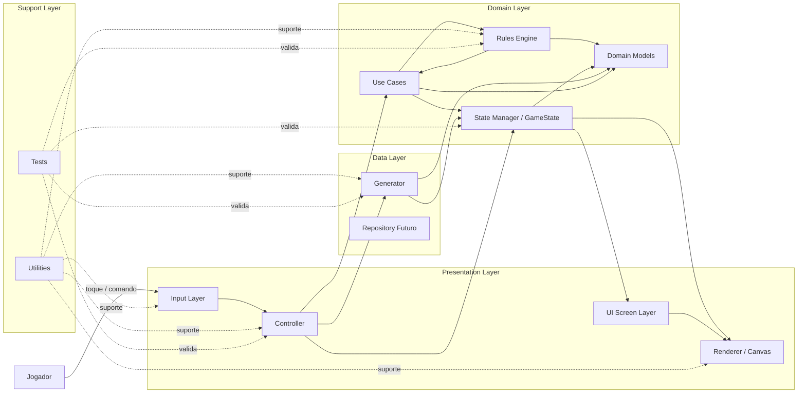

# 02 - Diagrama de Arquitetura em Camadas

## 2.1 Objetivo
Este diagrama apresenta a arquitetura oficial do VitahAcre em camadas, mostrando a organização estrutural do sistema, a direção do fluxo principal e a separação de responsabilidades entre os blocos centrais da aplicação.

Ele serve para:
- materializar visualmente a arquitetura definida no documento `04 - Arquitetura.md`;
- mostrar quem conversa com quem;
- deixar explícitas as dependências principais;
- proteger o projeto contra acoplamento indevido;
- servir como base para implementação, revisão técnica e testes.

---

## 2.2 Leitura do Diagrama
A arquitetura do VitahAcre segue uma lógica orientada a estado, com fluxo principal partindo da interação do usuário até a atualização da interface.

A cadeia canônica é:

- entrada do usuário;
- interpretação do evento;
- coordenação da jogada;
- avaliação das regras;
- atualização do estado;
- renderização do resultado.

A camada visual não decide regras.  
A camada de regras não desenha interface.  
O estado é a fonte única da verdade da sessão.

---

## 2.3 Diagrama Mermaid

2.4 Interpretação por Camada
Presentation Layer

Responsável por:

capturar a interação do usuário;
coordenar o fluxo visível da partida;
compor a UI;
desenhar o tabuleiro e os elementos visuais.

Ela não deve:

decidir regras do domínio;
criar estado paralelo;
remover peças por conta própria.
Domain Layer

Responsável por:

conter os modelos centrais do domínio;
executar as regras do jogo;
manter o estado formal da partida;
organizar casos de uso reutilizáveis.

Ela não deve:

depender de Canvas;
depender de composição visual;
misturar lógica com apresentação.
Data Layer

Responsável por:

gerar o tabuleiro;
fornecer estruturas iniciais de partida;
sustentar futura persistência, se o escopo evoluir.

Ela não deve:

controlar a jogabilidade corrente;
substituir o controller;
virar dona da lógica da sessão em andamento.
Support Layer

Responsável por:

utilitários auxiliares;
suporte técnico transversal;
testes e validação da arquitetura.
2.5 Fluxo Oficial da Arquitetura

O fluxo estrutural mínimo esperado é:

o jogador toca a tela;
a Input Layer captura o evento;
o Controller interpreta a intenção;
os Use Cases organizam a operação;
o Rules Engine valida a lógica da jogada;
o State Manager atualiza o estado oficial;
o Renderer / Canvas desenha a nova situação;
a UI reflete a sessão atual ao jogador.
2.6 Dependências Principais

As dependências esperadas nesta arquitetura são:

Input Layer → Controller
Controller → Use Cases
Use Cases → Rules Engine
Use Cases → State Manager
Controller → State Manager
Controller → Generator
Generator → State Manager
Rules Engine → Domain Models
State Manager → Domain Models
Generator → Domain Models
Renderer → State Manager
UI Screen Layer → Renderer
UI Screen Layer ↔ State Manager
2.7 Restrições Arquiteturais Visíveis no Diagrama

Este diagrama implica as seguintes restrições:

RA-01

O Renderer não decide regras de negócio.

RA-02

A Input Layer não muta diretamente o GameState.

RA-03

O Rules Engine não depende da interface gráfica.

RA-04

O Generator não controla a sessão depois que ela começa.

RA-05

O estado oficial da partida está concentrado no State Manager / GameState.

RA-06

Os testes validam especialmente:

regras;
estado;
generator;
controller.
2.8 Papel Estratégico do Diagrama

Este é um dos diagramas mais importantes do projeto porque:

organiza todo o restante;
serve de referência para a implementação;
ajuda a impedir spaghetti architecture;
define a espinha dorsal do sistema;
permite revisar dependências permitidas e proibidas.
2.9 Declaração Oficial

Este documento estabelece o Diagrama de Arquitetura em Camadas do projeto VitahAcre e deve ser lido como a representação estrutural oficial da organização do sistema nesta fase do projeto.
