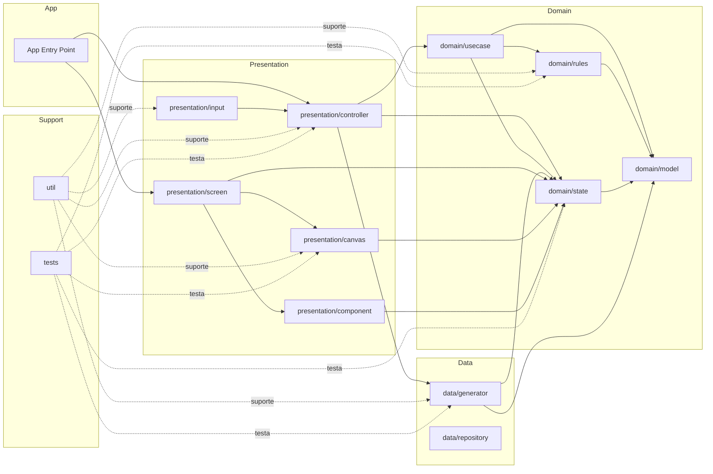

# 03 - Diagrama de Componentes

## 3.1 Objetivo
Este diagrama apresenta os componentes técnicos internos do projeto VitahAcre, traduzindo a arquitetura em camadas para blocos concretos de implementação.

Ele serve para:
- mostrar os componentes reais do sistema;
- organizar a futura estrutura de código;
- deixar claro o papel de cada módulo;
- orientar implementação, testes e manutenção;
- impedir acoplamento desordenado entre partes do projeto.

---

## 3.2 Leitura do Diagrama
O VitahAcre é composto por blocos técnicos distribuídos em quatro grandes zonas:

- aplicação;
- domínio;
- dados;
- apresentação.

Há ainda blocos de suporte técnico e testes.

O fluxo principal parte da apresentação, atravessa o domínio, utiliza a camada de dados quando necessário e retorna ao estado e à renderização.

---

## 3.3 Diagrama Mermaid

3.4 Interpretação dos Componentes
App Entry Point

Ponto de entrada da aplicação Android.

Responsável por:

iniciar o app;
carregar a tela principal;
conectar a base da aplicação à camada de apresentação.
domain/model

Contém as estruturas centrais do domínio, como:

Tile;
GameState;
GameStatus;
SelectionState;
BoardConfiguration;
InputEvent;
MatchResult;
BoardGenerationResult.

É o núcleo estrutural do sistema.

domain/rules

Contém a lógica pura do jogo.

Responsável por:

elegibilidade;
peça livre;
match;
vitória;
ausência de jogadas;
validações derivadas do domínio.
domain/state

Contém o estado formal da sessão.

Responsável por:

representar a partida;
sustentar a verdade oficial da sessão;
armazenar seleção, status e peças.
domain/usecase

Contém operações de domínio organizadas em fluxos reutilizáveis.

Responsável por:

coordenar regras e estado;
encapsular operações de maior nível;
organizar ações do jogo sem contaminar a UI.
data/generator

Responsável por:

gerar o tabuleiro;
distribuir pares;
organizar camadas;
validar condição inicial jogável;
devolver estrutura inicial da sessão.
data/repository

Bloco reservado para persistência futura, caso o projeto evolua para:

estatísticas;
preferências;
dados locais persistentes.

Não é central na versão base do jogo.

presentation/input

Responsável por:

capturar toques;
traduzir entrada em evento interno;
encaminhar eventos ao controller.
presentation/controller

Responsável por:

coordenar o fluxo da jogada;
chamar regras;
atualizar estado;
acionar generator quando necessário;
controlar reinício.
presentation/screen

Responsável por:

composição das telas;
ligação entre estado e visualização;
organização do layout principal do jogo.
presentation/component

Responsável por:

elementos visuais auxiliares e reutilizáveis;
botões;
overlays;
mensagens;
controles auxiliares.
presentation/canvas

Responsável por:

desenhar o tabuleiro;
desenhar peças;
mostrar seleção;
mostrar remoção;
materializar visualmente a sessão.
util

Responsável por:

funções auxiliares;
geometria;
matemática;
mapeamentos utilitários;
suporte transversal sem semântica central de domínio.
tests

Responsável por:

validar regras;
validar estado;
validar generator;
validar controller;
validar renderização básica.
3.5 Fluxo Principal Entre Componentes

O fluxo técnico principal esperado entre componentes é:

presentation/input recebe o toque;
presentation/controller interpreta a ação;
domain/usecase organiza o fluxo;
domain/rules valida a lógica;
domain/state é atualizado;
presentation/screen e presentation/canvas refletem o novo estado;
data/generator participa na criação de nova sessão ou reinício.
3.6 Componentes Mais Críticos do Projeto

Os componentes mais críticos para o núcleo do jogo são:

domain/model
domain/rules
domain/state
data/generator
presentation/controller
presentation/canvas

Esses componentes sustentam o coração funcional do VitahAcre.

3.7 Restrições Estruturais do Diagrama

Este diagrama implica as seguintes restrições:

RC-01

presentation/canvas não decide regras do jogo.

RC-02

presentation/input não altera diretamente o estado.

RC-03

domain/rules não depende de UI.

RC-04

data/generator não controla a partida em andamento.

RC-05

domain/model deve permanecer núcleo estrutural compartilhado.

RC-06

tests devem alcançar diretamente os componentes centrais do sistema.

3.8 Papel Estratégico do Diagrama

Este diagrama é importante porque:

transforma arquitetura em estrutura concreta;
facilita a montagem real do projeto;
prepara o encaixe modular em estilo LEGO;
ajuda o agente e o desenvolvedor a navegar pelo sistema;
reduz ambiguidade entre documentação e código.
3.9 Declaração Oficial

Este documento estabelece o Diagrama de Componentes do projeto VitahAcre e deve ser lido como a representação técnica oficial dos blocos internos do sistema nesta fase do projeto.
